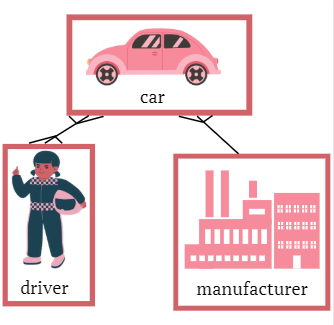
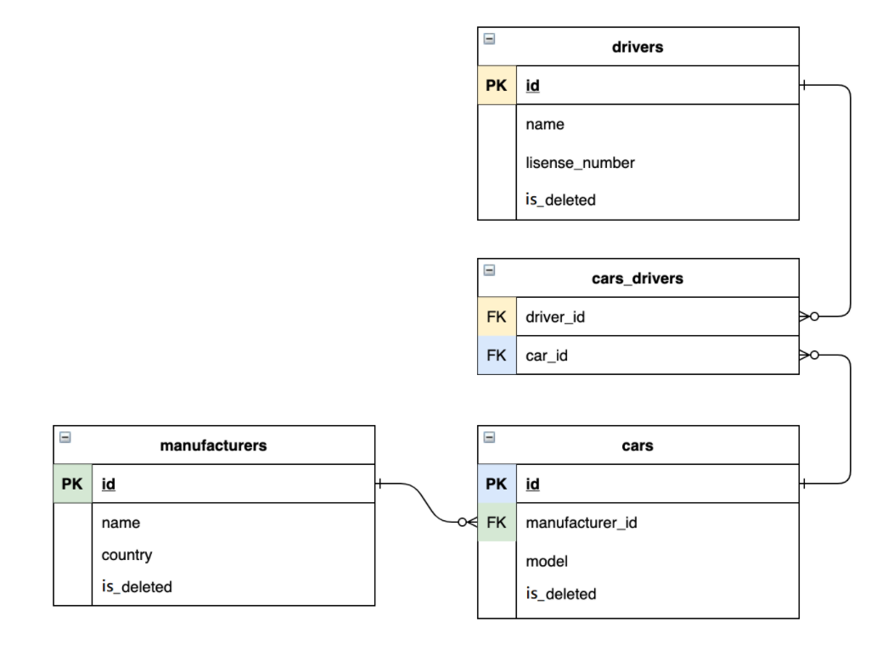

# taxi-service

### Hello, this is my project taxi service project for taxi drivers of taxi service.

Using this [link](https://taxi-service-2.herokuapp.com/drivers/add) on heroku project you can see all the features of the program, first [register a driver](https://taxi-service-2.herokuapp.com/drivers/add), then [log in](https://taxi-service-2.herokuapp.com/login) to his account and then view all the other links [here](https://taxi-service-2.herokuapp.com/)

Or you can [log in](https://taxi-service-2.herokuapp.com/login) using these credentials: 

login: mishamolnar

pass: 1234

#### General info

Taxi service is project that was created 
with the aim to show my skills in Java, OOP, 
SOLID principles, JDBC, Web. The web application provides the following features to registered users:
* Add drivers, cars and manufacturers
* View all drivers, cars and manufacturers
* Specify and save in a database the producers of the cars
* Add a driver to a specific car
* Delete a car, driver, or manufacturer (soft delete)

The structure of the database can be seen below

#### Technologies
The project was created using these technologies:

* Java 11
* MySQL
* Javax servlet API
* Jstl
* Tomcat 9.0.50 (to run app locally)
  
**Setup**
  
  To run this project:

* install MySQL
* install Tomcat 9.0.50
* fork this project and clone it
* initialize your database using init_db.sql file located in resources
* add your info to ConnectionUtil located in util to be able to connect to your database
* run this project using Tomcat's local server
